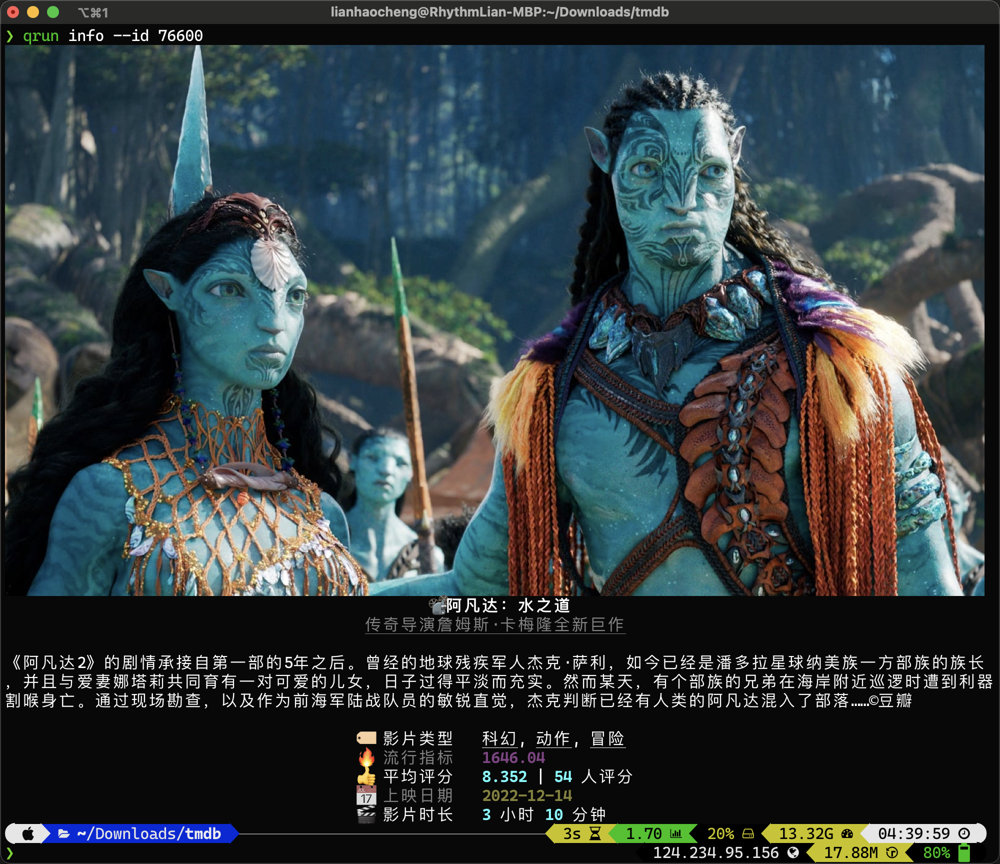

<h1 style="text-align: center"> tmdb </h1>

A Commander APP for TMDB

## Install

```shell
pip3 install git+https://github.com/Rhythmicc/tmdb.git -U
```

## Usage

```shell
tmdb --help
```

## Auto Complete for Fig/ZSH

```shell
tmdb complete
```

## Sample


